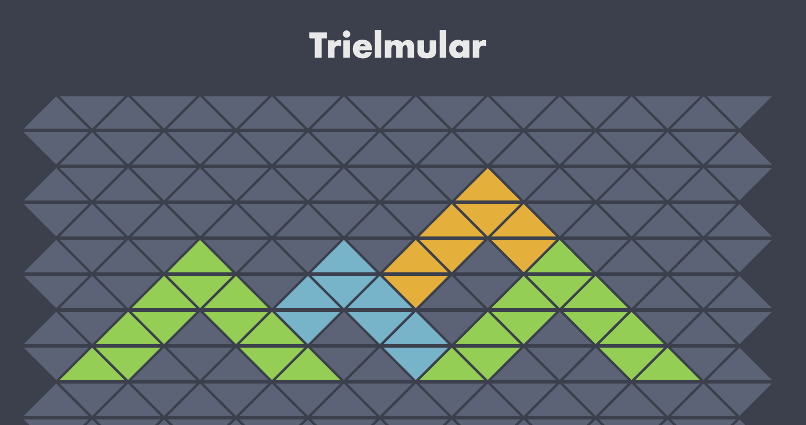

# Trielmular

A basic drawing App with Elm, a starter for your own graphic editing projects 

[Try/Demo](http://trielmular.amimetic.co.uk)



## About this project

Create graphics with Elm

A good starting point for something more interesting (e.g. add better controls, reset, scale triangles, add ordering, more colours, new drawing tools like fill or lines, different geometries, themes and more?)

### Install

```
yarn
```

### Serve locally:

```
yarn start
```

* Open [http://localhost:8080/](http://localhost:8080/)
* The main Elm file is `src/elm/Game.elm`
* Will auto reload on changes


### Build & bundle for prod:

```
yarn run build
```

* Files are saved into the `/dist` folder; will require web server due to paths (can't just open in browser)

### Deploy (route 53, subdomain example; other options should be fine as very simple `dist/` )

Having configured/created aws-config.json

```
yarn run build
gulp deploy
```

Needs S3 bucket ID (which matches sub domain)

configuration of route 53

create record set
name (must match s3 id)
choose alias
target should appear as option if subdomain + s3 bucket name match

will take a few minutes to actually work

### Deploy with now

Install if required:

```
npm i -g now
```

To actually deploy

```
cd dist
now
```

### Alternative deployments

Whatever option selected must ensure that serving from route as js url is relative to `/` i.e. treat `dist` as root.
